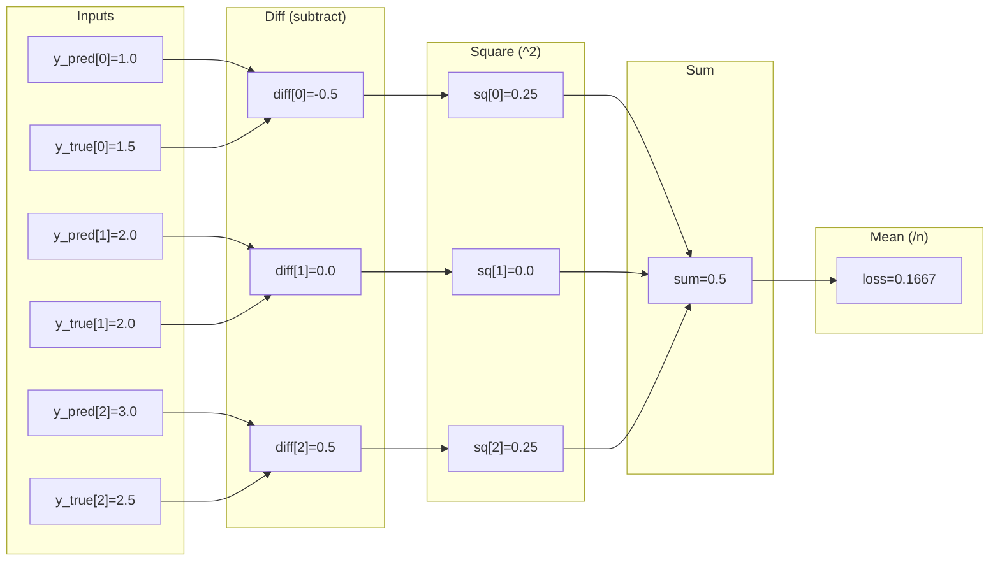

# MSE Backward Pass Visualization

## Forward Pass Graph



## Backward Pass (gradients flow right-to-left)

```
loss.grad = 1.0
    ↓ (/n backward: multiply by 1/3)
sum.grad = 0.333
    ↓ (sum backward: distribute equally)
sq[0].grad = 0.333,  sq[1].grad = 0.333,  sq[2].grad = 0.333
    ↓ (square backward: multiply by 2*diff due to chain rule)
diff[0].grad = 0.333 * 2 * (-0.5) = -0.333
diff[1].grad = 0.333 * 2 * (0.0)  =  0.0
diff[2].grad = 0.333 * 2 * (0.5)  =  0.333
    ↓ (distribute backward alongwith sign multiplication: +1 to y_pred, -1 to y_true)
y_pred[0].grad = -0.333
y_pred[1].grad =  0.0
y_pred[2].grad =  0.333
```

## Summary

- **Forward**: `L = (1/n) * Σ(y_pred - y_true)²`
- **Backward**: `dL/dy_pred = (2/n) * (y_pred - y_true)`
